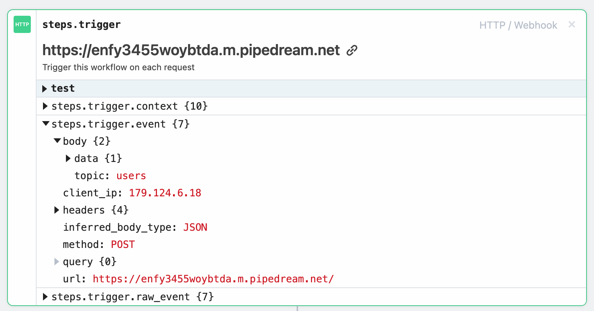

## Node.js Webhook Trigger

> A simple implementation of a webhook event trigger with nodejs.

### Restore deps:

```bash
$ npm ci
```

### Run application:

```bash
$ npm run dev
```

### Send a new `webhook  event` to clients:

To send an event to the client's webhook list, use this simple cURL:

```bash
curl --request POST \
  --url http://localhost:3000/trigger-event \
  --header 'Content-Type: application/json'


#response: {"data":"webhook event sent"}
```

All webhooks URLs in list, will receive the event with two attributes in the body: `topic` and `data`.

In this example we have two URL will receive the event: 

- 1 - The event received on pipedream on URL `https://enfy3455woybtda.m.pipedream.net`:


- 2 - In `app.js` (route `webhook-client`) has an example that simulates an external client notification URL usage of the webhook data received.

## Motivation
I just wanted to learn how the big APIs sent events to a URL notification, of course using Nodejs to do that.